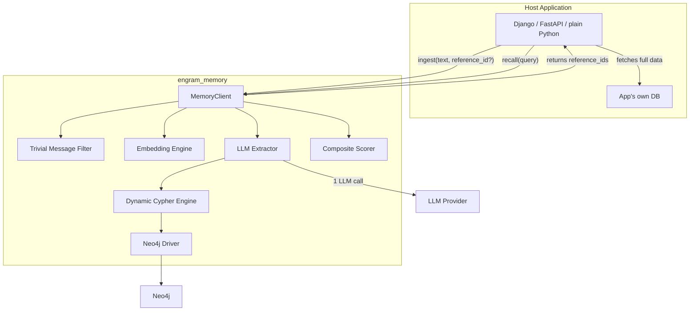
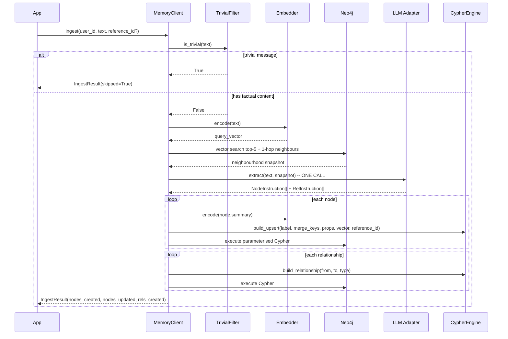
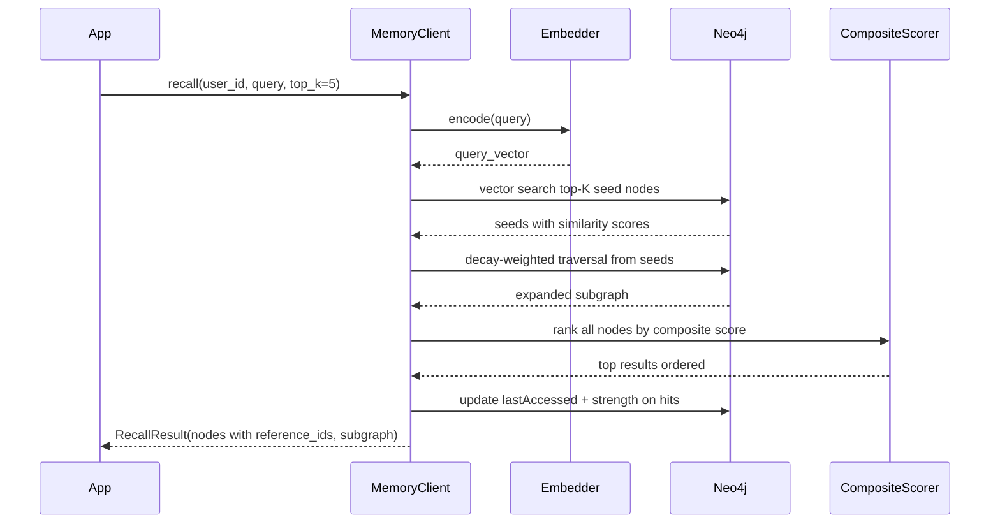

# Engram SDK -- Final Plan (Phase 1 + Phase 2 Roadmap)

## Core Principles

1. **Front-load intelligence at ingestion** (1 LLM call to extract + place correctly)
2. **Harvest it for free at retrieval** (0 LLM calls, graph structure does the work)
3. **Zero hardcoded schema** -- LLM decides labels, properties, merge keys, relationships at runtime
4. **Graph-only SDK** -- Neo4j is the only backend; no relational DB managed by the SDK
5. **Reference, not storage** -- developer passes `reference_id` to link nodes to their own external data
6. **Publishable as SDK** -- zero framework imports in core; `contrib/` bridges for Django etc.

## Architecture




### SDK vs Developer Ownership

- **SDK owns (Neo4j):** extracted entity nodes (dynamic labels, properties, summary, embedding), relationships, vector index, graph traversal, `reference_id` as a property, decay tracking (lastAccessed, strength)
- **Developer owns (their stack):** full document text, file bytes, raw chat messages, database tables / S3 / file systems, meaning of `reference_id` (PK, UUID, S3 key, URL), application business logic

The SDK never reads or writes to the developer's database.

---

## Ingestion: 1 LLM Call (or 0 for trivial messages)




**Key design decisions:**

- **Trivial filter** ([extractors/trivial_filter.py](engram_memory/extractors/trivial_filter.py)): short text + no entity markers + common non-factual patterns = skip entirely, zero LLM cost
- **Neighbourhood-aware extraction**: send only top-5 vector matches + 1-hop neighbours as context (~200-500 tokens), not the full graph. One LLM call does extraction + placement + relationship decisions.
- **Dynamic Cypher**: [graph/engine.py](engram_memory/graph/engine.py) generates parameterised MERGE/SET from any label, any merge keys, any properties. Labels sanitised via regex before interpolation.
- **reference_id**: stored as `referenceId` property on every node created from this ingest. Optional.

### LLM Output Contract ([models.py](engram_memory/models.py))

```python
class NodeInstruction(BaseModel):
    operation: Literal["create", "update"]
    ref: str | None = None          # existing node elementId (for updates)
    label: str                      # PascalCase, LLM-chosen
    merge_keys: dict[str, Any]      # compound uniqueness key
    properties: dict[str, Any]      # all fields to SET
    summary: str                    # short text for embedding

class RelInstruction(BaseModel):
    from_ref: str
    to_ref: str
    type: str                       # UPPER_SNAKE_CASE

class IngestResult(BaseModel):
    skipped: bool = False
    nodes_created: list[NodeResult] = []
    nodes_updated: list[NodeResult] = []
    relationships_created: list[RelResult] = []
```

### Security

- **userId**: function argument, never from LLM output. Every Cypher includes `WHERE n.userId = $uid`.
- **Label/rel sanitisation**: `re.sub(r'[^A-Za-z0-9_]', '', label)` in [graph/sanitise.py](engram_memory/graph/sanitise.py)
- **Properties**: all parameterised, never interpolated
- **Pydantic validation**: rejects invalid LLM JSON before it touches Neo4j

---

## Retrieval: 0 LLM Calls (optional rerank)




### Decay-Weighted Traversal ([graph/traversal.py](engram_memory/graph/traversal.py))

BFS from seeds. Each hop multiplies score by `decay` (default 0.5). Stops expanding when `score < min_score` (default 0.1). `max_depth` is a safety cap (default 5). Adaptive: dense relevant clusters go deep, sparse areas stop early.

### Composite Scoring ([graph/scorer.py](engram_memory/graph/scorer.py))

```
final_score = alpha * vector_similarity + beta * (decay ^ hops) + gamma * node_strength
Default: alpha=0.5, beta=0.35, gamma=0.15
```

### Optional LLM Reranking

`recall(..., rerank=True)` over-fetches 20 candidates, one LLM call picks the best `top_k`.

---

## Package Structure

```
engram_memory/                        # sibling to uktalentvisa/
    __init__.py                     # exports: MemoryClient, Config
    config.py                       # env-based Config dataclass
    client.py                       # MemoryClient -- single entry point
    models.py                       # Pydantic: NodeInstruction, RelInstruction, IngestResult, RecallResult, ScoredNode
    exceptions.py                   # EngramError, ExtractionError
    extractors/
        __init__.py
        base.py                     # BaseExtractor ABC
        trivial_filter.py           # is_trivial() -- skip non-factual messages
        llm_extractor.py            # neighbourhood + user text -> NodeInstruction[] via LLM
        prompts.py                  # extraction prompt template (compactness rules)
    graph/
        __init__.py
        driver.py                   # Neo4j session/transaction wrapper
        engine.py                   # Dynamic Cypher generator
        traversal.py                # Decay-weighted BFS
        scorer.py                   # Composite scoring
        indexes.py                  # Vector index + constraint setup
        sanitise.py                 # Label/rel type sanitisation
    embeddings/
        __init__.py
        base.py                     # BaseEmbedding ABC
        sentence_transformer.py     # all-MiniLM-L6-v2 local
    llm/
        __init__.py
        base.py                     # BaseLLM ABC (generate_json)
        anthropic_adapter.py        # Anthropic Claude
        openai_adapter.py           # OpenAI (stub)
    contrib/
        __init__.py
        django.py                   # Django settings bridge + singleton
    pyproject.toml
    requirements.txt
    tests/
        conftest.py
        test_client.py
        test_trivial_filter.py
        test_extractor.py
        test_engine.py
        test_traversal.py
        test_scorer.py
```

## Public API

```python
from engram_memory import MemoryClient, Config

client = MemoryClient()   # auto-config from env
# or: MemoryClient(config=Config(neo4j_uri=..., llm_provider="anthropic", ...))

result = client.ingest(user_id="u123", text="I work at Google", reference_id="msg-42")
context = client.recall(user_id="u123", query="work experience", top_k=5)
context = client.recall(user_id="u123", query="strengths", top_k=5, rerank=True)
graph = client.get_graph(user_id="u123")
results = client.search(user_id="u123", query="machine learning", top_k=5)
client.delete_memory(user_id="u123", node_id="neo4j-element-id")
```

## Config (env vars)

`NEO4J_URI`, `NEO4J_USER`, `NEO4J_PASSWORD`, `LLM_PROVIDER` (anthropic|openai), `ANTHROPIC_API_KEY`, `OPENAI_API_KEY`, `ANTHROPIC_BASE_URL`, `ANTHROPIC_MODEL`, `EMBEDDING_MODEL` (default all-MiniLM-L6-v2), `EMBEDDING_DIMENSIONS` (default 384), `GRAPHMEMORY_LOG_LEVEL`.

No DATABASE_URL. No relational DB config. Neo4j + LLM + Embeddings only.

## Dependencies

**Required:** `neo4j>=5.0`, `pydantic>=2.0`
**Optional:** `sentence-transformers` (embedding), `anthropic>=0.40` (LLM), `openai>=1.0` (LLM)

## Cost Model


| Operation        | LLM | Embedding | Neo4j | Latency |
| ---------------- | --- | --------- | ----- | ------- |
| Ingest (trivial) | 0   | 0         | 0     | ~1ms    |
| Ingest (factual) | 1   | 1+N       | 3     | ~2-3s   |
| Recall (default) | 0   | 1         | 2     | ~50ms   |
| Recall (rerank)  | 1   | 1         | 2     | ~2s     |
| Search           | 0   | 1         | 1     | ~30ms   |
| get_graph        | 0   | 0         | 1     | ~20ms   |


---

## Phase 2: Future Enhancements

- Background decay/archival job (archive nodes where strength drops below threshold)
- Relationship weight learning from access patterns (frequently traversed paths become "highways")
- Hot-path LRU cache per user (invalidate on ingest)
- Two-tier embedding (coarse quantized for fast scan + fine for reranking)
- OpenAI adapter wiring, async MemoryClient, PyPI publishing
- Reflective summarisation (overnight parent-node clustering)
- State versioning for mutable facts (current_state + history relationship)

### Future Consideration: Hierarchical Summary Tree (B-tree for Semantic Memory)

A retrieval optimisation where the same graph contains a tree overlay of summary nodes at different levels of abstraction. Most queries are answered from compact summaries without traversing leaf nodes.

**Structure (same graph, no second database):**

```
Level 0 (Root):     ONE node per user -- summary of everything
Level 1 (Clusters): Topic summaries -- handful per user (work, education, skills)
Level 2+ (Leaves):  Individual entity nodes -- the real extracted data
```

**How it works:**

- Every node gets a `level` property (0, 1, 2, ...). Level 0-1 are summary nodes; Level 2+ are leaf entities.
- `CONTAINS` relationships form the tree. Semantic relationships (`WORKS_AT`, `ACHIEVED`) coexist on the same nodes -- no duplication, one graph.
- **Retrieval uses level filtering:** broad queries search Level 0-1 only (~10 nodes, near-instant). Detail queries fall through to Level 2+ with decay-weighted traversal.
- **Cluster summaries built without LLM:** concatenate child summaries + re-embed locally. Mark parents `stale=true` when children change; refresh lazily or in background.
- **Alternative:** piggyback cluster assignment on the extraction LLM call (still 1 call total).

**Scale impact:** as a user's graph grows from 10 to 500+ nodes, flat vector search degrades linearly. With the hierarchy, most queries hit ~10-15 summary nodes regardless of total graph size -- constant-time retrieval (B-tree property).

**Why this matters:**


| Graph size | Phase 1 (flat) | Phase 1 + hierarchy |
| ---------- | -------------- | ------------------- |
| 10 nodes   | Scans 10       | Scans ~3            |
| 50 nodes   | Scans 50       | Scans ~8            |
| 200 nodes  | Scans 200      | Scans ~12           |
| 500 nodes  | Scans 500      | Scans ~15           |
| 2000 nodes | Scans 2000     | Scans ~20           |


**Status:** needs further study. Phase 1 works without this. The hierarchy is additive -- layers on top without breaking existing nodes or relationships.